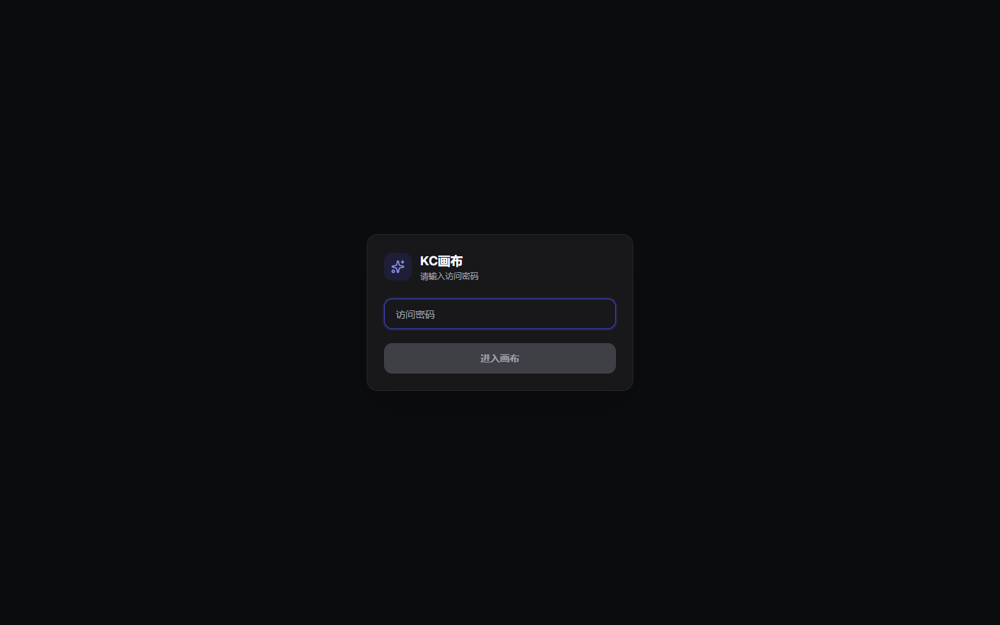
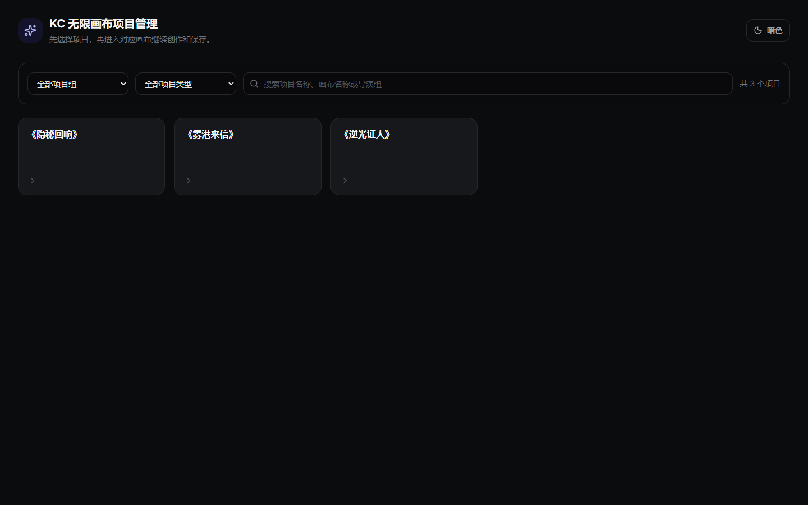
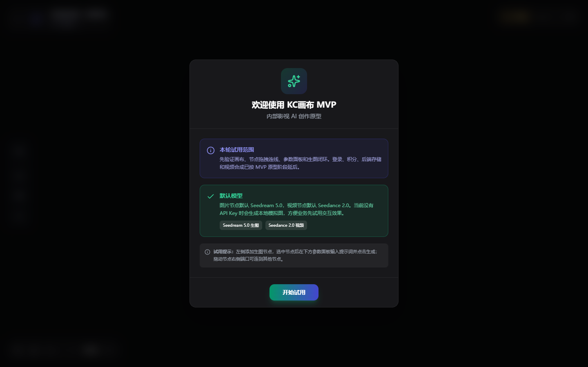
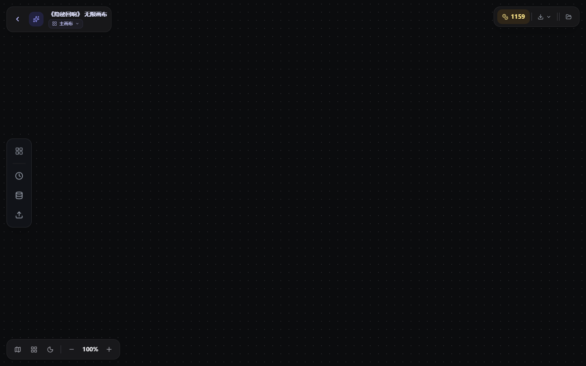
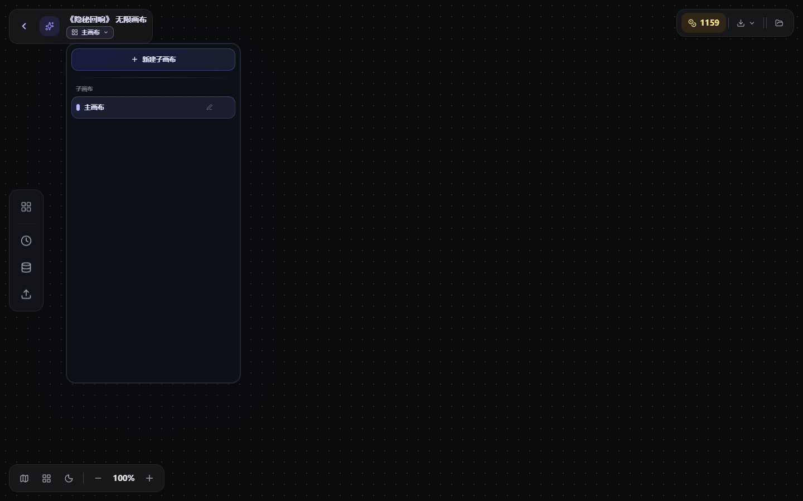
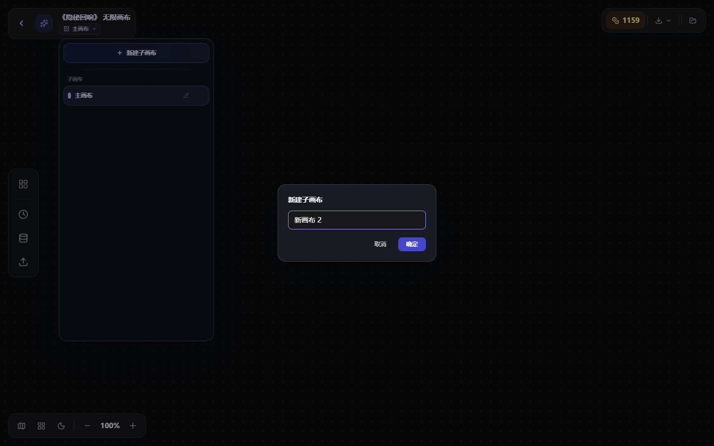

# KC 无限画布小白入门操作 SOP

> 适用对象：第一次使用 KC 无限画布的业务人员、分镜/视频生成专员、项目负责人。  
> 使用目标：从进入系统开始，完成“选项目 -> 建画布 -> 添加节点 -> 上传/引用素材 -> 连线生成 -> 保存结果 -> 备份导出”的完整闭环。

## 0. 先看完整操作链路

```mermaid
flowchart LR
  A[进入系统] --> B[输入访问密码]
  B --> C[进入项目管理页]
  C --> D[筛选或搜索项目]
  D --> E[打开项目]
  E --> F[首次确认开始试用]
  F --> G[选择或新建子画布]
  G --> H[添加文本/生图/生视频节点]
  H --> I[上传或拖入素材]
  I --> J[节点连线与参数配置]
  J --> K[生成/裁剪/多角度编辑]
  K --> L[保存到项目素材或资产库]
  L --> M[导出备份或继续迭代]
```

## 1. 进入系统并登录

1. 打开 KC 画布系统地址。
2. 在登录页找到“访问密码”输入框。
3. 输入当前访问密码。
4. 点击“进入画布”。

注意事项：

- 输入密码前，“进入画布”按钮可能是灰色，输入后会变为可点击状态。
- 如果密码错误，页面会提示登录失败；重新确认密码后再试。
- 当前原型是内部 MVP，登录成功后会进入“KC 无限画布项目管理”页面。

## 2. 在项目管理页选择项目

进入系统后，先看到项目管理页。这里不是直接开始画图，而是先确定本次创作要归属到哪个项目。

操作步骤：

1. 查看页面上方标题“KC 无限画布项目管理”。
2. 如项目较多，可使用顶部筛选：
   - “全部项目组”：按导演组筛选。
   - “全部项目类型”：按短剧等项目类型筛选。
   - 搜索框：输入项目名称、画布名称或导演组关键词。
3. 在项目卡片中找到目标项目。
4. 点击项目卡片，进入该项目对应的画布空间。

新手建议：

- 不确定选哪个项目时，优先按项目名称搜索。
- 不要在错误项目里创建画布，否则后续素材、积分和备份都容易归到错误项目。
- 项目卡片代表项目空间，不代表具体某一个图片或视频任务。

## 3. 首次进入项目后的确认弹窗

首次进入画布时，系统会弹出“欢迎使用 KC画布 MVP”的说明弹窗。

操作步骤：

1. 快速阅读“本轮试用范围”和“默认模型”说明。
2. 确认当前是内部原型环境。
3. 点击“开始试用”。

说明：

- 该弹窗用于提醒当前系统是 MVP 原型，重点验证画布、节点、连线、参数面板和生成闭环。
- 如果本地或演示环境没有真实 API Key，部分生成会走模拟结果，用于保证流程能跑通。

## 4. 认识画布主界面

进入画布后，主要区域可以分为 5 块：

| 区域 | 位置 | 用途 |
| --- | --- | --- |
| 返回项目列表 | 左上角返回箭头 | 回到项目管理页，切换其他项目 |
| 当前项目与画布名 | 左上角标题区 | 显示当前项目的无限画布名称 |
| 子画布选择 | 标题下方“主画布”下拉 | 切换或新建项目下的子画布 |
| 左侧工具栏 | 左侧竖排图标 | 添加节点、查看生成历史、打开项目资产库、导入素材 |
| 画布操作区 | 中央网格区域 | 摆放节点、拖拽、连线、生成、整理工作流 |

基础手势：

- 拖动画布空白处：平移视野。
- 鼠标滚轮或缩放按钮：放大/缩小画布。
- 拖动节点：调整节点位置。
- 点击节点：选中节点并显示对应操作。
- 双击部分文本节点：进入编辑状态。

## 5. 新建或切换子画布

一个项目下可以有多个子画布。子画布适合按团队、分镜段落、角色方向或探索方向拆开管理，避免所有内容都堆在一张大画布里。

切换子画布：

1. 点击左上角当前子画布名称，例如“主画布”。
2. 在下拉面板里查看已有子画布。
3. 点击目标子画布名称，即可切换。

新建子画布：

1. 点击“新建子画布”。
2. 在弹窗里输入画布名称。
3. 点击“确定”。
4. 系统创建新子画布，并进入该画布继续操作。

命名建议：

- 按分镜段落命名：例如“第 1 集 03 场”。
- 按资产方向命名：例如“角色参考探索”。
- 按任务阶段命名：例如“初版分镜生成”“多角度精修”。

## 6. 添加第一个节点

画布里的工作都是围绕节点展开。常用节点包括：

| 节点 | 适合做什么 | 新手使用场景 |
| --- | --- | --- |
| 文本 | 写剧本、提示词、创作说明 | 先整理一段分镜描述或角色设定 |
| 生图 | 文本生图、参考图再生成 | 根据提示词生成角色、场景、道具图 |
| 生视频 | 文本/图片生成视频 | 把分镜描述或参考图转成视频片段 |
| 音频 | 文本转语音或上传音频 | 做旁白、语音参考或音频素材 |

操作步骤：

1. 点击左侧工具栏的“添加”入口。
2. 在添加面板中选择“文本”“生图”或“生视频”。
3. 新节点会出现在画布中央或当前视野附近。
4. 拖动节点到合适位置，方便后续连线。

新手建议：

- 第一次使用建议先加一个“文本”节点，把本次创作目标写清楚。
- 再加“生图”或“生视频”节点，用文本节点作为上游参考。

## 7. 上传图片、视频或文本素材

系统支持通过上传入口把本地素材变成标准节点。

支持类型：

- 图片：会自动创建图片/生图类节点。
- 视频：会自动创建视频类节点。
- 文本：支持 `.txt`、`.md`、`.markdown`，会自动创建文本节点。

常用操作方式：

1. 在画布空白处右键。
2. 选择上传入口。
3. 选择本地文件。
4. 系统按文件类型自动创建对应节点。

补充方式：

- 可以把本地图片或视频拖入画布。
- 可以复制图片后粘贴到画布。
- 从节点连线到空白处后再选择上传，上传后的新节点会自动与来源节点建立关系。

## 8. 使用文本节点整理提示词

文本节点适合承载创作说明、剧本段落、角色设定和提示词。

操作步骤：

1. 点击或双击文本节点进入编辑。
2. 输入你要描述的内容，例如角色外貌、场景氛围、镜头要求。
3. 如果需要模型处理，选择对应模型并点击生成。
4. 文本结果可以继续作为后续生图或生视频的参考。

提示词写法建议：

- 先写主体：人物、场景、道具是什么。
- 再写风格：写实、电影感、短剧感、年代感等。
- 再写镜头：近景、中景、全景、俯拍、仰拍等。
- 最后写约束：不要出现的元素、画幅、清晰度等。

## 9. 使用生图节点生成图片

生图节点用于创建图片，也可以接收上游文本或图片作为参考。

基础步骤：

1. 新建或选中“生图”节点。
2. 在节点参数区输入提示词。
3. 选择画幅、分辨率等参数。
4. 如需参考图，把图片节点连接到生图节点。
5. 点击生成按钮。
6. 等待生成结果出现在节点里。

生成后可以继续：

- 下载图片。
- 保存到项目素材。
- 添加到项目资产库。
- 对图片做裁剪。
- 对图片做多角度控制。
- 继续连接到下游生图或生视频节点。

## 10. 使用生视频节点生成视频

生视频节点用于把文字描述、图片参考或多媒体素材转换为视频结果。

基础步骤：

1. 新建或选中“生视频”节点。
2. 输入视频提示词或分镜说明。
3. 如果需要图片参考，把图片节点连接到生视频节点。
4. 检查模型、比例、时长等参数。
5. 点击生成。
6. 等待任务完成后查看视频结果。

注意事项：

- 图片或文本节点作为上游时，连线方向要从参考素材指向生视频节点。
- 如果系统提示“请连接并引用素材”，说明当前视频模式需要上游素材。
- 生成失败时，优先查看节点内的失败原因，再调整提示词或参考图。

## 11. 节点连线：把创作链路串起来

连线的作用是表达“谁作为谁的参考”。

常见连线方式：

1. 鼠标移到节点边缘，看到圆形连接点。
2. 从上游节点连接点拖出线。
3. 拖到下游节点连接点后松开。
4. 成功后，两个节点之间会出现连线。

典型链路：

- 文本节点 -> 生图节点：用剧本/提示词生成图片。
- 图片节点 -> 生图节点：用参考图继续生成变体。
- 图片节点 -> 生视频节点：用参考图生成视频。
- 文本节点 -> 生视频节点：用分镜描述生成视频。

新手判断：

- 上游通常是“参考内容”。
- 下游通常是“要生成或处理的新结果”。
- 如果连不上，通常是节点类型不匹配或方向反了。

## 12. 从项目资产库复用角色、场景、道具

项目资产库用于复用已有角色、场景和道具。

操作步骤：

1. 点击左侧工具栏的“项目资产库”。
2. 在项目库或公共库中查找资产。
3. 可按角色、场景、道具等类型筛选。
4. 点击“添加到画布”。
5. 资产会以标准图片节点进入画布。

说明：

- 资产入画布后，不再是只读图片，而是可继续裁剪、多角度、连线、生成和保存的标准节点。
- 公共库适合跨项目复用，项目库适合当前项目内部复用。

## 13. 对图片做裁剪

当图片只需要局部区域时，可以使用裁剪功能。

操作步骤：

1. 选中已有图片节点。
2. 打开节点上的功能菜单。
3. 选择“图片裁剪”。
4. 在裁剪弹窗中选择画幅和裁剪区域。
5. 点击“生成裁剪节点”。
6. 系统会生成一个新的图片节点，并自动连接来源节点。

使用建议：

- 裁剪角色局部时，尽量保留完整主体边缘。
- 裁剪场景参考时，保留关键空间关系。
- 不要在原节点上反复覆盖，使用新裁剪节点可以保留版本链路。

## 14. 对图片做多角度控制

多角度控制适合把一张角色图、场景图或道具图转换成不同视角。

操作步骤：

1. 选中已有图片节点。
2. 打开节点功能菜单。
3. 选择“多角度控制”。
4. 设置水平环绕、垂直俯仰、景别缩放。
5. 选择输出画幅。
6. 可补充光线、质感、构图等提示词。
7. 点击生成。
8. 系统会生成新的多角度图片节点，并连接来源节点。

常用场景：

- 正面角色图 -> 背面或侧面参考。
- 中景场景图 -> 全景俯拍。
- 道具图 -> 不同角度展示。

## 15. 保存结果到项目素材或资产库

当图片、视频或文本结果满意后，需要沉淀到项目中，避免只停留在画布节点里。

操作步骤：

1. 选中有结果的节点。
2. 点击保存相关操作。
3. 在弹窗中填写素材或资产名称。
4. 选择保存目标：
   - 项目素材：只保存到当前项目素材库。
   - 新建资产：创建角色、场景或道具资产。
   - 更新资产：把结果作为已有资产的新版本。
5. 点击确认保存。

选择建议：

- 临时结果、分镜过程图：保存到项目素材。
- 可复用角色、场景、道具：保存为新资产。
- 已有角色或场景的优化版本：更新资产版本。

## 16. 导出图片、视频、文本或完整备份

右上角下载/文件相关入口用于导出结果和备份画布。

常见导出：

- 导出图片：保存当前画布中的图片结果。
- 导出视频：保存当前画布中的视频结果。
- 导出文本：保存文本节点内容。
- 导出全部：导出多类型结果。
- 画布备份：导出当前画布节点、连线、项目名、视口等数据，方便迁移或恢复。

备份建议：

- 重要项目每天结束前导出一次画布备份。
- 大量生成或大改节点结构前，先导出备份。
- 切换设备或浏览器前，先导出备份文件。

## 17. 画布导航与整理

当节点越来越多时，建议使用导航工具保持画布整洁。

常用功能：

- 缩放比例：查看当前缩放百分比。
- 加号/减号：放大或缩小。
- 小地图：快速定位画布内容区域。
- 整理画布：自动排列节点，减少重叠。
- 主题切换：暗色/亮色显示切换。

新手建议：

- 节点从左到右排列，左边放参考素材，右边放生成结果。
- 同一条创作链路尽量保持一行或一组。
- 不同方向探索使用不同子画布，不要全部堆在一张画布。

## 18. 推荐的新手完整练习任务

第一次上手时，可以按下面的练习跑一遍：

1. 登录系统。
2. 在项目管理页选择《隐秘回响》或当前测试项目。
3. 点击“开始试用”。
4. 打开“主画布”下拉，新建一个子画布，命名为“新手练习”。
5. 添加一个“文本”节点，输入一段分镜描述。
6. 添加一个“生图”节点，把文本节点连接到生图节点。
7. 在生图节点补充画幅和风格参数，点击生成。
8. 对生成图片做一次裁剪，得到新的裁剪节点。
9. 对原图或裁剪图做一次多角度控制。
10. 把满意的图片保存到项目素材。
11. 导出当前画布备份。

完成以上 11 步，就基本掌握了从项目进入到画布创作、结果沉淀和备份的核心流程。

## 19. 常见问题速查

| 问题 | 可能原因 | 处理方式 |
| --- | --- | --- |
| 登录后看不到画布 | 还停留在项目管理页 | 先选择项目卡片 |
| 进入项目后被弹窗挡住 | 首次欢迎弹窗未关闭 | 点击“开始试用” |
| 找不到新建画布入口 | 没有打开左上角子画布下拉 | 点击“主画布”或当前子画布名称 |
| 上传后节点类型不对 | 文件类型和预期不一致 | 检查文件是图片、视频还是文本 |
| 节点连不上 | 方向反了或类型不匹配 | 从参考素材拖向生成节点，确认节点类型 |
| 生成失败 | 提示词、参考素材或模型环境异常 | 查看节点失败原因，调整后重试 |
| 画布太乱 | 节点太多且未分组 | 使用整理画布，或拆分到多个子画布 |
| 结果找不到 | 只在节点里生成，未保存 | 使用保存入口沉淀到项目素材或资产库 |
| 换电脑后没有画布 | 本地数据未迁移 | 使用画布备份导出/导入 |

## 20. 新手操作规范

推荐做法：

- 每次进入系统，先确认项目名称。
- 每个任务开始前，先建清晰命名的子画布。
- 文本、图片、视频节点按“参考 -> 生成 -> 精修 -> 保存”排列。
- 重要结果及时保存到项目素材或资产库。
- 每天收工前导出画布备份。

避免做法：

- 不看项目名就直接创建节点。
- 所有探索都堆在“主画布”。
- 只生成不保存，导致结果后续难找。
- 删除节点前没有确认是否还有下游连线。
- 用同一个节点反复覆盖重要版本，不保留过程链路。

